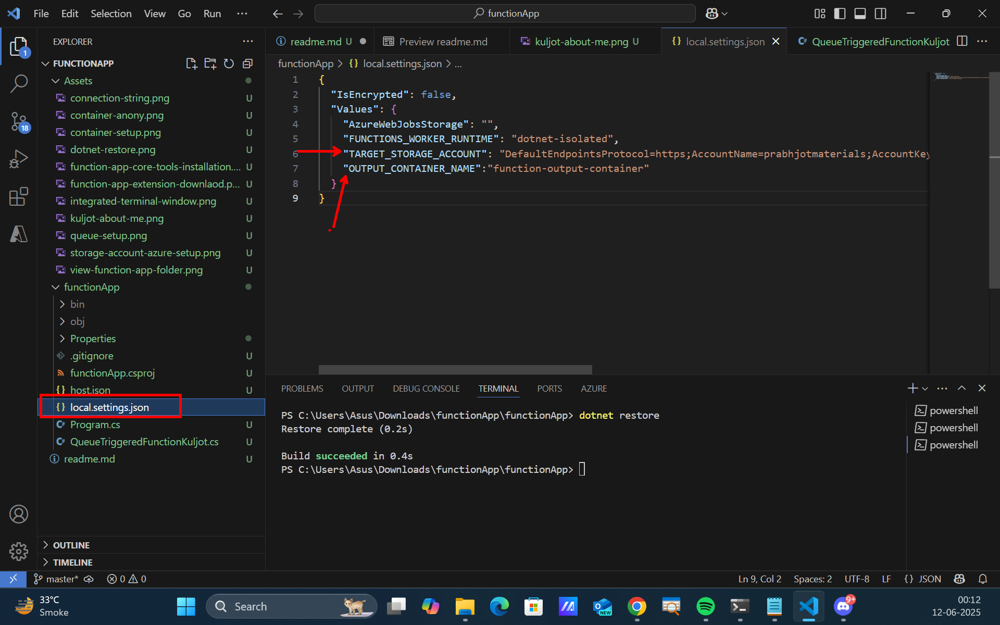

# Lab: Azure Function App Demo

**Author:** Kuljot (MSingh) Bakshi  
**Udemy Profile:** [View Kuljot's Udemy Profile](https://www.udemy.com/user/kuljot-singh-bakshi/)  
**Website:** [Visit Kuljot's Website](https://www.learnwithmsingh.com/)


---

## Overview

This lab demonstrates how to build an Azure Function App with a queue-based trigger that writes messages to a blob container.

---

## Prerequisites

1. **Visual Studio Code**  
2. **.NET SDK**  
    - Check installation: `dotnet --version`
    - [Download .NET SDK](https://dotnet.microsoft.com/en-us/download/dotnet/thank-you/sdk-9.0.301-windows-x64-installer)

---

## Step 1: Install Function App Extension

Install the Azure Functions extension from the VSCode Marketplace.


---

## Step 2: Install Azure Functions Core Tools

- [Download Azure Functions Core Tools](https://learn.microsoft.com/en-us/azure/azure-functions/functions-run-local?tabs=windows%2Cisolated-process%2Cnode-v4%2Cpython-v2%2Chttp-trigger%2Ccontainer-apps&pivots=programming-language-csharp)
- Verify installation: `func --version`


---

## Step 3: Create a Storage Account in Azure

Set up a storage account for your function app.


---

## Step 4: Create a Blob Container

- Name: `function-output-container`
- Access Level: **Container (Anonymous Access)** (not `private`)


---

## Step 5: Create an Input Queue

- Name: `function-input-queue`
- Use the same storage account as above.


---

## Step 6: Initialize the Function App

1. Open the `functionApp` folder in the integrated terminal.
2. Run `dotnet restore` to install dependencies.


---

## Step 7: Configure Environment Variables

Edit `local.settings.json` in the function app folder:

- **TARGET_STORAGE_ACCOUNT**: Storage account connection string
- **OUTPUT_CONTAINER_NAME**: `function-output-container`

To get the connection string, go to the **Access Keys** tab in your Azure Storage Account.


Example `local.settings.json`:



Set the input queue name in `QueueTriggeredFunctionKuljot.cs` as shown:


---

## Step 8: Run the Function App Locally

1. Open the `functionApp` folder in the terminal.
2. Start the app:  
    ```
    func start host
    ```


---

## Step 9: Test the Function App

1. Go to the input queue and add the following JSON message:

     ```json
     {
        "name": "kuljot (MSingh) Bakshi",
        "description": "Kuljot Singh Bakshi is a dedicated Azure and AI Instructor with a wealth of experience, particularly known for his engaging courses on Udemy. His passion for technology and education has empowered countless students to achieve their goals and advance their careers. He is also a Microsoft Certified Trainer (MCT) and a Microsoft Learn Student Ambassador (MLSA). He is also a C#-Corner MVP, helping the developer community with his contributions.",
        "Udemy Profile": "https://www.udemy.com/user/kuljot-singh-bakshi/",
        "Website": "https://www.learnwithmsingh.com/"
     }
     ```

     

2. Observe the function app logs in the terminal:

     

     > **Note:** After refreshing the queue, the message should disappear.

3. Check the blob container for a new `.txt` file containing the message:

     
     

---

**End of Lab**
